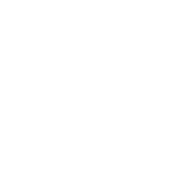

Занимаюсь программированием, OSINT и кибербезопасностью.
Интересуюсь разведкой по открытым источникам, анализом угроз и разработкой.

 

 

## Направления

- **OSINT** — сбор и анализ информации из открытых источников
- **Cybersecurity** — анализ уязвимостей, сетевая безопасность
- **Программирование** — C/C++, C#, Python, Bash, немного веб-разработки (fullstack)

  

